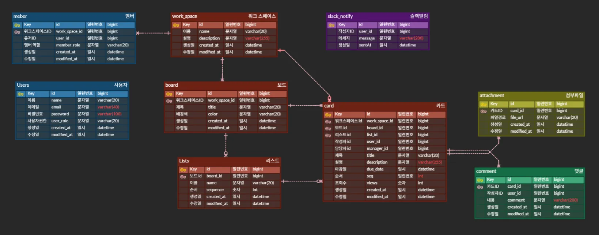
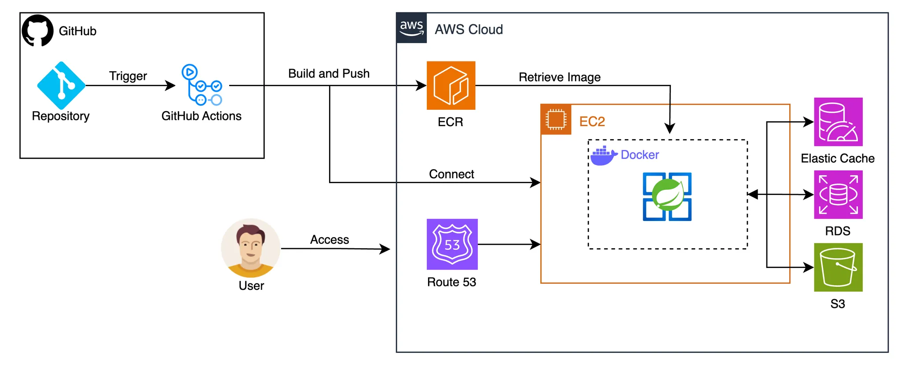

수정된 프로젝트 API 문서는 아래와 같습니다:

---

# 프로젝트 관리 협업 툴 서비스 API

## 1. 프로젝트 개요

이번 프로젝트에서는 Trello와 유사한 프로젝트 관리 툴의 백엔드를 개발합니다. Trello는 칸반 보드(Kanban Board) 방식을 사용하여 작업을 시각적으로 관리할 수 있는 협업 도구로, 다양한 작업을 우선순위에 따라 쉽게 관리하고 팀원 간의 효율적인 협업을 지원합니다. 본 프로젝트는 이를 바탕으로 실무 환경에서 활용할 수 있는 백엔드 시스템을 구축하는 것을 목표로 합니다.

 

## 2. 주요 기술 스택

 
  
   
   
  

 

- **Backend**: Spring Boot
- **Database**: MySQL, Redis (AWS Elastic Cache)
- **Cloud**: AWS S3, EC2
- **CI/CD**: Github Actions
- **Containerization**: Docker

 

## 3. 기능별 담당자

<table>
  <tbody>
    <tr>
      <td align="center"><a href="https://github.com/devmoonjs"> <b>팀장 : 문정석 </b></a> </td>
      <td align="center"><a href="https://github.com/jay1864"> <b>팀원 : 한지은 </b></a> </td>
      <td align="center"><a href="https://github.com/ilmechaJu"> <b>팀원 : 이현중 </b></a> </td>
      <td align="center"><a href="https://github.com/ks12467"> <b>팀원 : 김현수 </b></a> </td>
    </tr>
  </tbody>
</table>

| **세부 항목**                     | **담당자** |
|-------------------------------|---------|
| **테스크코드 작성**                  | **전원**  |
| **회원가입 및 로그인**                | **김현수** |
| **멤버 및 역할 관리**                | **김현수, 문정석** |
| **워크스페이스**                    | **문정석** |
| **보드**                        | **이현중** |
| **리스트**                       | **이현중** |
| **카드**                        | **한지은** |
| **댓글**                        | **문정석** |
| **첨부파일**                      | **김현수** |
| **알림**                        | **한지은** |
| **검색**                        | **한지은** |
| **최적화**                       | **김현수** |
| **캐싱**                        | **한지은** |
| **배포와 CI/CD**                 | **문정석** |

 

### **회원가입/로그인**

#### 기능 설명
- **회원가입**: 유저는 이메일 형식의 아이디와 복잡한 비밀번호(대소문자, 숫자, 특수문자를 포함한 최소 8글자)를 통해 회원가입이 가능합니다. 비밀번호는 `Bcrypt`로 인코딩됩니다. 유저는 일반 유저(USER)와 관리자(ADMIN) 중 하나의 권한으로 가입할 수 있습니다.
- **로그인**: 유저는 회원가입 시 사용한 아이디와 비밀번호로 로그인할 수 있습니다.

#### 예외처리
- 중복된 유저 아이디로 가입하려는 경우
- 잘못된 이메일 또는 비밀번호 형식
- 비밀번호가 일치하지 않는 경우

---

### **멤버 및 역할 관리**

#### 기능 설명
- **유저 권한**: Trello 애플리케이션에서 유저는 일반 유저(USER) 또는 관리자(ADMIN) 권한을 가집니다. 관리자 권한을 가진 유저는 워크스페이스를 생성하고 다른 유저를 관리자로 설정할 수 있습니다.
- **멤버 역할**: 유저가 워크스페이스에 초대되면 멤버가 됩니다. 각 멤버는 워크스페이스와 보드에서 역할을 부여받습니다. 읽기 전용 멤버는 데이터를 생성, 수정, 삭제할 수 없고 조회만 가능합니다.

#### 예외처리
- 잘못된 이메일로 멤버 초대를 시도하는 경우
- 워크스페이스 권한이 없는 멤버가 멤버 초대를 시도하는 경우

---

### **워크스페이스(Workspace)**

#### 기능 설명
- **워크스페이스 생성 및 관리**: 관리자 권한을 가진 유저는 워크스페이스를 생성할 수 있습니다. 워크스페이스 내에 여러 보드가 포함될 수 있으며, 관리자만 워크스페이스를 수정하거나 삭제할 수 있습니다.
- **워크스페이스 멤버 초대**: 워크스페이스 내에서 멤버를 초대하여 협업할 수 있습니다. 초대는 이메일을 통해 이루어집니다.

#### 예외처리
- 존재하지 않는 이메일로 초대하는 경우
- 권한 없는 멤버가 워크스페이스 수정이나 삭제를 시도하는 경우

---

### **보드(Board)**

#### 기능 설명
- **보드 생성 및 관리**: 워크스페이스 내에서 멤버는 보드를 생성하고 수정할 수 있습니다. 보드에는 제목과 배경색, 이미지를 설정할 수 있습니다.
- **보드 조회 및 삭제**: 보드의 리스트와 카드는 함께 조회됩니다. 보드를 삭제하면 해당 보드의 모든 리스트와 카드도 삭제됩니다.

#### 예외처리
- 읽기 전용 멤버가 보드를 생성, 수정, 삭제하려는 경우
- 로그인하지 않은 유저가 보드를 생성하려는 경우

---

### **리스트(Lists)**

#### 기능 설명
- **리스트 생성 및 관리**: 보드 내에서 리스트를 생성하고 순서를 변경할 수 있습니다. 각 리스트는 보드 내에서 순서를 가집니다.
- **리스트 삭제**: 리스트 삭제 시, 리스트 내의 모든 카드도 함께 삭제됩니다.

#### 예외처리
- 읽기 전용 멤버가 리스트를 생성, 수정, 삭제하려는 경우

---

### **카드(Card)**

#### 기능 설명
- **카드 생성 및 관리**: 리스트 내에서 카드의 생성과 수정이 가능합니다. 카드에는 제목, 설명, 마감일, 담당자 등이 추가됩니다.
- **카드 조회 및 삭제**: 카드 조회 시 상세 정보와 함께 활동 내역 및 댓글을 확인할 수 있습니다. 카드 삭제 시, 관련된 데이터도 함께 삭제됩니다.

#### 예외처리
- 읽기 전용 멤버가 카드를 생성, 수정, 삭제하려는 경우

---

### **댓글(Comment)**

#### 기능 설명
- **댓글 작성 및 관리**: 카드 내에서 댓글을 작성하고, 수정하거나 삭제할 수 있습니다. 댓글에는 텍스트와 이모지를 포함할 수 있습니다.

#### 예외처리
- 댓글 작성자가 아닌 멤버가 댓글을 수정하거나 삭제하려는 경우
- 읽기 전용 멤버가 댓글을 생성하려는 경우

---

### **첨부파일(Attachment)**

#### 기능 설명
- **첨부파일 관리**: 카드에 이미지를 포함한 파일을 첨부할 수 있습니다. 최대 5MB 크기의 파일 업로드가 허용되며, 지원되는 파일 형식은 이미지(jpg, png), 문서(pdf, csv)입니다.

#### 예외처리
- 지원되지 않는 파일 형식을 업로드하려는 경우
- 파일 크기가 제한을 초과한 경우
- 읽기 전용 멤버가 파일을 삭제하려는 경우

---

### **알림(Notification)**

#### 기능 설명
- **알림 관리**: 카드 변경, 댓글 작성, 멤버 추가 등의 주요 이벤트에 대해 실시간 알림이 제공됩니다. 슬랙 또는 디스코드 알림을 통해 확인할 수 있습니다.

---

### **검색**

#### 기능 설명
- **카드 검색**: 카드의 제목, 내용, 마감일, 담당자 등을 기준으로 페이징 처리된 검색 결과를 제공합니다. 또한 특정 보드 내 모든 카드를 검색할 수 있습니다.

---

## 4. 최적화 전략

### **데이터 성능 최적화: 인덱싱과 캐싱**

#### 인덱싱 (Indexing)

##### 문제 정의
- **카드 검색 속도 저하**: 데이터가 대량으로 축적되면서 카드 검색 시 성능이 저하되는 문제가 발생했습니다.

##### 해결 방안
- **인덱스 설계**: 자주 사용되는 조건에 맞는 컬럼에 인덱스를 적용하여 검색 속도를 최적화했습니다.
- **쿼리 최적화**: 실행 계획 분석을 통해 비효율적인 쿼리를 개선하고, 인덱스를 통해 빠른 검색을 지원했습니다.

##### 첨부 자료
- 쿼리 속도 비교(before, after)

#### 캐싱 (Caching)

##### 문제 정의
- **카드 조회 성능 저하**: 자주 조회되는 카드 정보를 매번 DB에서 조회하는 데 시간이 걸려 조회 성능에 영향을 미쳤습니다.

##### 해결 방안
- **Redis 캐싱 적용**: 자주 조회되는 카드의 조회수를 캐시에 저장하여 조회 성능을 개선했습니다. 매일 자정에 조회수가 초기화되도록 설정하여 인기 카드 랭킹을 효과적으로 관리했습니다.
- **어뷰징 방지**: 동일 유저가 조회수를 무제한으로 올리는 것을 방지하는 로직을 적용했습니다.

##### 첨부 자료
- 캐싱 적용 방법과 전략
- 자정에 조회수를 리셋하는 캐시 전략
- 캐시 적용 전후의 카드 조회 성능 비교

---

### **CI/CD 자동화: 신속하고 안정적인 배포**

#### 문제 정의
- **수동 배포의 비효율성**: 코드 변경 시마다 수동으로 빌드, 테스트, 배포를 수행하는 것은 시간 소모가 크고 비효율적이었습니다.

#### 해결 방안
- **CI/CD 파이프라인 구성**: 자동화된 CI/CD 파이프라인을 구성하여 코드 변경 시 자동으로 빌드, 테스트, 배포가 이루어지도록 했습니다. 이를 통해 빠른 배포와 코드 안정성을 확보했습니다.
- **보안 강화**: 민감한 정보나 설정 파일이 배포 과정에서 노출되지 않도록 GitHub Actions Secret Key 를 활용하였습니다.

#### 첨부 자료
- 자동 빌드 및 테스트, 배포 구성 과정
- CI/CD 파이프라인 적용 전후의 효율성 차이

 

## 5. ERD

 

## 6. 아키텍처

 
